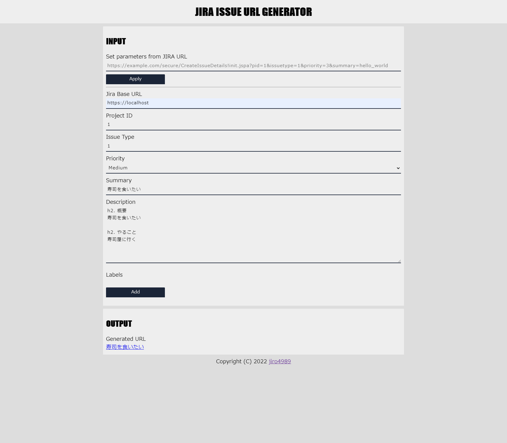

= jira_issue_url_generator
:toc: left
:sectnums:

image:https://github.com/jiro4989/jira_issue_url_generator/workflows/test/badge.svg[test, link=https://github.com/jiro4989/jira_issue_url_generator/actions]
image:https://codecov.io/gh/jiro4989/jira_issue_url_generator/branch/main/graph/badge.svg[codecov, link=https://codecov.io/gh/jiro4989/jira_issue_url_generator]

https://www.atlassian.com/software/jira[JIRA]の issues を作成するURL(direct HTML links)をUIで作れるようにします。
GitHub Pagesで動作する静的なWebアプリです。

* https://jiro4989.github.io/jira_issue_url_generator/

== direct HTML linksとは

JIRAは専用のURLを踏むことで、URLからissuesを作成することができます。
要約や説明といったissuesの要素はクエリパラメータから設定することができます。

ただし、いきなりissuesを作成するのではなく、issuesを作成する手前の下書き状態までやってくれます。
実際にissues作成を実行するのは、UIでボタンを押すあなたです。

参考:

https://confluence.atlassian.com/jirakb/how-to-create-issues-using-direct-html-links-in-jira-server-159474.html[How to create issues using direct HTML links in Jira Server]

※古い機能らしくいつまで使えるかは不明。そのうち廃止される可能性もある。

== 使い方

=== 新規にURLを生成する

新規にURLを生成する場合は `JIRA Base URL` 以降のみを入力してください。
Project ID と Issue Type の値はプロジェクトによって異なる場合があるので、各自で調べてください。

プロジェクトIDの調べ方は以下を参照してください。

https://ja.confluence.atlassian.com/jirakb/how-to-get-project-id-from-the-jira-user-interface-827341414.html[How to get project id from the Jira User Interface]

inputを入力すると自動で OUTPUT にURLが生成されます。
このURLをブックマークに保存するなりして自由に使ってください。

=== direct HTML linksからURLを生成する

前述の方法で生成したURLを貼り付けて値を書き換えます。
この機能が欲しくて自作しました。

以下の手順を実施してください

. `Set parameters from JIRA URL` にURLを貼り付ける
. `Apply` ボタンを押す

入力すると、Input各種にクエリパラメータの値が設定されます。
あとはInputの値を修正して、OUTPUTのURLをブックマークなりに保存してください。

== 開発者向け

=== 前提条件

Node.jsのバージョンを固定するために nodenv を使ってます。
以下の手順でNode.jsをセットアップしてください。

[source,bash]
----
nodenv install
----

=== 使ってる技術

. TypeScript
. React.js

=== サーバの起動

[source,bash]
----
npm start
----

=== コードフォーマット

[source,bash]
----
npm run format
----

=== テスト

[source,bash]
----
npm test
----

=== GitHub Pagesの更新

Gitのタグを追加すると更新される。

以下の様に、新規タグを作成してPushするだけで良い。

[source,bash]
----
# v0.1.0 を発行する例
git tag v0.1.0
git push origin v0.1.0
----
